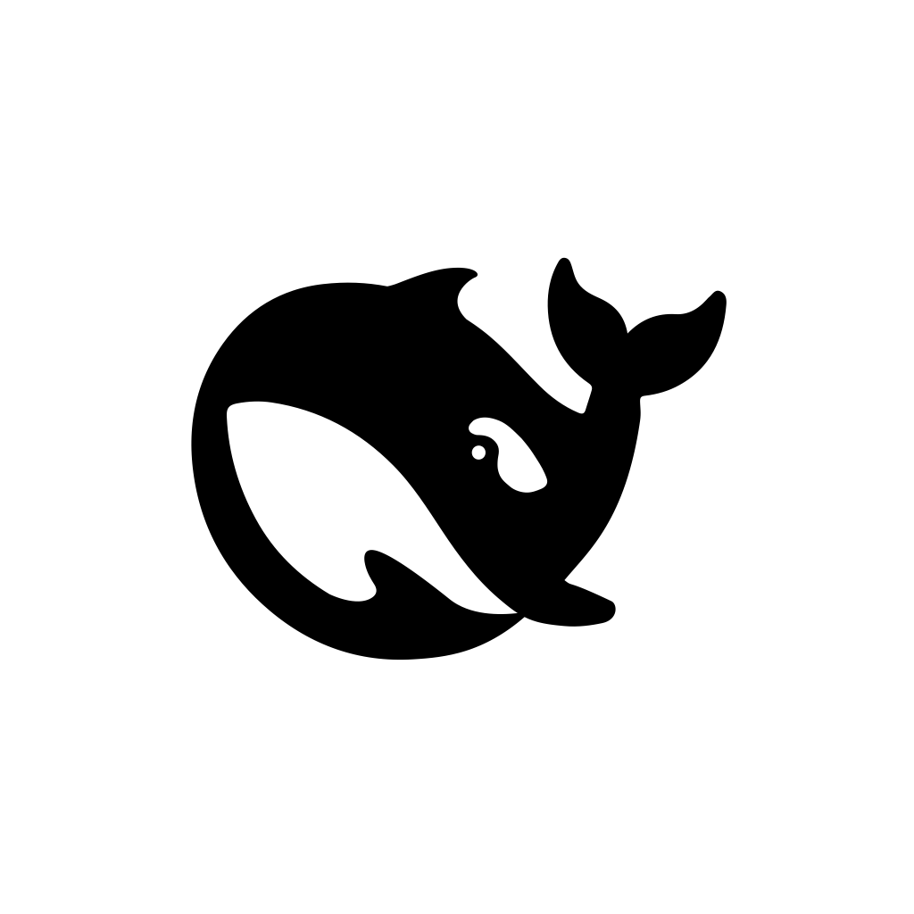

<div align="center">



# DeepSeek Harness Mac

**An unofficial SwiftUI macOS shell for the [DeepSeek Harness](https://github.com/deepseek-ai/DeepSeek-Harness) local web UI.**

[](LICENSE)


[English](README.md) · [中文](README.zh.md)

</div>

> [!IMPORTANT]
> **Disclaimer** — This is an unofficial community project. It is **not affiliated with,
> endorsed by, or sponsored by DeepSeek**. The name "DeepSeek" and the whale logo are
> trademarks of DeepSeek and remain its property; they are referenced here solely for
> technical compatibility.
>
> **免责声明** — 本项目是社区开发的非官方封装，与 DeepSeek（深度求索）无任何关联，
> 亦未获得其认可或背书。"DeepSeek" 名称与鲸鱼 Logo 的商标归 DeepSeek 所有。

## Overview

DeepSeek Harness Mac launches the DeepSeek Harness CLI (`dsh web`) as a local service and
presents its web UI in a native `WKWebView` window. The window behaves like a proper macOS
citizen: closing it only hides the UI while the service keeps running in the background,
clicking the Dock icon restores it, and `⌘Q` quits everything.

## Features

- **Fast startup** — reuses the `dsh` install already cached by `npx`, so subsequent
  launches skip dependency resolution; falls back to `npx` when no cache exists.
- **Native downloads** — downloads are handled by `WKDownloadDelegate`: a macOS save panel
  is presented for Session Logs and other files (including frontend-generated `blob:`
  downloads). The web UI's own "download started" dialog is suppressed; cancelled downloads
  stay silent, and a confirmation appears only after the file has actually been saved.
- **Dock-friendly lifecycle** — the red close button hides the window while the service
  keeps running; a Dock click restores the window; `⌘Q` fully quits and terminates the
  entire child process tree.
- **Robust startup UI** — the window shows progress while the service boots, loads the web
  UI as soon as the local URL is known, and offers an actionable error state with a restart
  button on failure.
- **Official icon** — the app icon derives from the official black whale `favicon.svg`
  shipped in the DeepSeek Harness web UI package, keeping its original path outline and
  black fill on a rounded white macOS background
  (generator: [`Scripts/make_icon.swift`](Scripts/make_icon.swift)).

## Requirements

| Requirement | Version | Needed for | How to install |
| --- | --- | --- | --- |
| macOS | 13.0+ | Running | — |
| Xcode Command Line Tools | any recent | Building | `xcode-select --install` |
| Node.js (with `npx`) | 20+ (LTS) recommended | Running | `brew install node`, [nvm](https://github.com/nvm-sh/nvm), or [Volta](https://volta.sh) |

## Installation

### Build from source

```bash
# 1. Clone the repository
git clone https://github.com/Carleo10032/deepseek-harness-mac.git
cd deepseek-harness-mac

# 2. Install the Xcode Command Line Tools if `swiftc` is missing
xcode-select --install

# 3. Build the app bundle
chmod +x build.sh
./build.sh
```

The app bundle is produced at `build/DeepSeek Harness.app`.

### Install into /Applications

```bash
cp -R "build/DeepSeek Harness.app" /Applications/
open "/Applications/DeepSeek Harness.app"
```

> **Note on Gatekeeper:** `build.sh` signs the bundle with an ad-hoc signature, which is
> fine for locally built copies. If a copy obtained from the internet is blocked by
> Gatekeeper, remove its quarantine attribute — only for copies you trust:
>
> ```bash
> xattr -dr com.apple.quarantine "/Applications/DeepSeek Harness.app"
> ```

## Usage

- Launch the app. It starts the local service and shows the web UI as soon as the port is
  known.
- The harness session runs with `~/Documents/Vibe` as its working directory when that
  folder exists, otherwise your home directory
  (see `defaultWorkingDirectory()` in [`Sources/main.swift`](Sources/main.swift)).
- Click the red close button to hide the window — the service keeps running. Click the Dock
  icon to bring the window back.
- Press `⌘Q` to fully quit the app and shut down the service.
- If startup fails, the window shows the last log line and a restart button.

## How it works

1. On launch, the app locates a DeepSeek Harness executable, in order:
   1. a global `dsh` on `PATH` (`/opt/homebrew/bin/dsh`, `/usr/local/bin/dsh`, …),
   2. the `dsh` matching version `0.1.0-rc.6` inside the `~/.npm/_npx` cache,
   3. fallback: `npx --yes @deepseek-ai/dsh@0.1.0-rc.6`.
2. It runs `web --host 127.0.0.1 --port 0` — a loopback-only listener on a random free port.
3. It parses the `http://127.0.0.1:<port>` URL from the child process output and loads it
   in a `WKWebView`.

The harness version is pinned to `0.1.0-rc.6` in `Sources/main.swift`.

## Troubleshooting

| Symptom | Likely cause | Fix |
| --- | --- | --- |
| "找不到 npx，请先安装 Node.js" | `npx` is not on `PATH` | Install Node.js and relaunch |
| First launch takes a while | `npx` cache miss | Expected once; later launches reuse the cached `dsh` |
| The window shows a failure message | The local service exited | Read the last log line shown in the window and make sure the pinned `dsh` version is reachable |
| macOS blocks a downloaded copy ("damaged app") | Gatekeeper + ad-hoc signature | `xattr -dr com.apple.quarantine` (see Installation) |

## Contributing

Bug reports and pull requests are welcome. Fork the repository, build with `./build.sh`,
and keep changes minimal and focused. Report issues on the
[issue tracker](https://github.com/Carleo10032/deepseek-harness-mac/issues).

## License

[MIT](LICENSE) © 2026 Carleo10032

Built on top of [DeepSeek Harness](https://github.com/deepseek-ai/DeepSeek-Harness)
(MIT © DeepSeek). The app icon derives from the `favicon.svg` shipped in its web UI
package; the "DeepSeek" name and whale logo are trademarks of DeepSeek.
